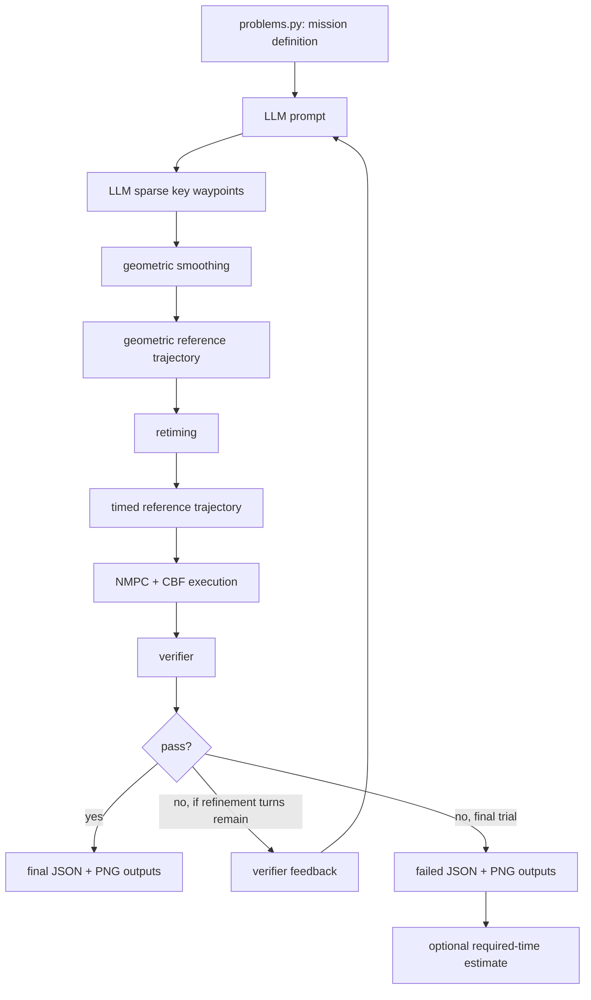

# LLM + Retiming + NMPC/CBF Crazyflie Mission Planner

This repository implements a research pipeline for multi-agent Crazyflie mission
planning and execution. An LLM proposes sparse mission-level waypoints, and the
local toolchain converts them into timed trajectories, executes them through an
NMPC/CBF layer, verifies feasibility, and saves plots/logs for inspection.

The current default pipeline is:



The LLM is responsible for high-level route decisions such as target order,
charging stops, obstacle detours, and final routing. It is not trusted to produce
dynamically feasible timestamps. Timing, execution, and verification are handled
by local optimization and checking code.

The refinement loop is verifier-driven. If a trial fails and refinement turns
remain, the verifier reason is appended as feedback to the next LLM call. With
the default `max_refinement_turns=2`, the pipeline can run up to three LLM
trials total. Required-time estimation is only attached on the final failed trial
when that option is enabled.

## Are NMPC, CBF, and Retiming Used?

Yes. Unless disabled by command-line flags, the current code uses both retiming
and NMPC/CBF execution.

| Entry point | Retiming default | NMPC/CBF default | Backend default | Problem default |
| --- | --- | --- | --- | --- |
| `python tool_pipeline.py` | ON | ON | `cascade` | `MA1` |
| `python Two_drone_tracking.py` | ON | ON | `cascade` | `MA4` |
| SpiderPi live replan | ON | ON | `cascade` | active problem |

Relevant flags:

```powershell
# Disable retiming
python tool_pipeline.py --no-retiming

# Disable NMPC/CBF execution
python tool_pipeline.py --no-nmpc-cbf

# Use the full motor-level backend
python tool_pipeline.py --nmpc-backend full
```

One important detail: `tool_pipeline.py` only runs NMPC/CBF if the retiming
stage does not report feasibility issues. In other words, the default path is
"retime, then execute with NMPC/CBF", but if retiming already fails, the verifier
checks the retimed reference instead of an NMPC/CBF-executed trajectory.

The default `cascade` backend uses `nmpc_cbf.py`. The optional `full` backend
uses `full_motor_nmpc.py`, requires CasADi/IPOPT, and is much slower.

## Quick Start

### Run the LLM refinement pipeline

```powershell
python tool_pipeline.py --problem-id MA4
```

This command:

- asks the LLM for sparse key waypoints,
- smooths them into geometric reference trajectories,
- retimes the references to the requested mission time,
- executes the retimed references with the cascade NMPC/CBF backend,
- verifies mission, obstacle, separation, battery, dynamics, and timing
  constraints,
- retries with verifier feedback if refinement is enabled,
- saves JSON and PNG outputs.

### Generate a reference-only trajectory

```powershell
python tool_pipeline.py --reference-only --problem-id MA4
```

This skips the LLM and uses `recommended_key_waypoints` from `problems.py`.
It is useful for debugging smoothing, retiming, and verification without LLM
variability.

### Execute the built-in reference through NMPC/CBF

```powershell
python tool_pipeline.py --execute-reference --problem-id MA4
```

This builds the reference trajectory, retimes it, executes it with the selected
NMPC/CBF backend, verifies the executed trajectory, and saves plots.

### Prepare a hardware run without connecting to hardware

```powershell
python Two_drone_tracking.py --dry-run --problem-id MA4
```

This prepares or loads the trajectory and prints a summary without connecting to
QTM or the Crazyflies.

### Run hardware tracking

```powershell
python Two_drone_tracking.py --problem-id MA4
```

By default, `Two_drone_tracking.py` uses `--trajectory-source llm`, so it runs
the LLM pipeline before tracking unless an existing trajectory is reused.

To reuse an existing verified trajectory:

```powershell
python Two_drone_tracking.py --reuse-existing-llm-trajectory
```

To intentionally track a trajectory even when verification failed:

```powershell
python Two_drone_tracking.py --allow-unverified
```

## SpiderPi Live Replanning

`Two_drone_tracking.py` can trigger a live LLM replan during MA4-style hardware
execution when the SpiderPi moving obstacle gets close to a drone.

Default SpiderPi settings:

| Setting | Default |
| --- | --- |
| Trigger distance | `0.6 m` |
| SpiderPi max speed | `0.02 m/s` |
| SpiderPi prediction horizon | `20.0 s` |
| Replan latency buffer | `20.0 s` |
| SpiderPi z offset | `0.3 m` |
| Replan output | `llm_spiderpi_replan_trajectory.json` |

Disable live replanning with:

```powershell
python Two_drone_tracking.py --no-spiderpi-replan
```

During live replan, the original charging-station start positions are not reused.
The current QTM-measured drone positions become the new dynamic starts. Targets
that were already completed are removed from the remaining required target list,
and only unfinished targets are passed to the verifier.

The live replan prompt includes:

- elapsed mission time,
- remaining mission budget,
- current drone positions,
- completed targets,
- remaining targets,
- required route skeleton from current position to remaining targets to final
  goal,
- log-based battery estimates,
- current SpiderPi position,
- SpiderPi reachable-set safety rule.

The SpiderPi reachable danger radius is described to the LLM as:

```text
danger_radius = spiderpi_safety_radius
              + spiderpi_max_speed * min(t + latency_buffer, prediction_horizon)
```

With the current defaults, this reserves up to `0.02 * 20 = 0.4 m` of SpiderPi
motion budget immediately after replanning.

The reason for the `0.4 m` reserve is practical latency. In the current
experiment, an LLM replan usually takes about 20 seconds. During that time, the
SpiderPi may keep moving. With `spiderpi_max_speed = 0.02 m/s`, a 20 second
planning latency gives:

```text
0.02 m/s * 20 s = 0.4 m
```

Because the prediction horizon is also capped at 20 seconds, the latency buffer
saturates the horizon immediately. The LLM is therefore asked to keep drones
outside a conservative `0.4 m` reachable danger radius around the measured
SpiderPi effective position.

### Latest MA4 SpiderPi Replan Result

The latest logged MA4 live-replan run generated:

- overlap plot: `spiderpi_effective_replan_overlap_original_only.png`,
- replan JSON: `llm_spiderpi_replan_trajectory.json`,
- replan center: `[0.274190, 0.077420, 0.763564]`,
- trigger radius: `0.6 m`,
- reachable danger radius used for replanning: `0.4 m`.

The original pre-replan path entered the `0.6 m` trigger region around the
SpiderPi effective position:

| Path | Minimum distance to replan center | Points inside `0.6 m` | Points inside `0.4 m` |
| --- | ---: | ---: | ---: |
| Original cf1 path | `0.468793 m` | `12` | `0` |
| Original cf2 path | `0.536689 m` | `35` | `0` |

The replanned path improves the SpiderPi clearance relative to the reachable
danger radius:

| Path | Minimum distance to replan center | Points inside `0.6 m` | Points inside `0.4 m` |
| --- | ---: | ---: | ---: |
| Replanned cf1 path | `0.607444 m` | `0` | `0` |
| Replanned cf2 path | `0.597608 m` | `2` | `0` |

cf2 starts almost exactly at the `0.6 m` trigger boundary because it is the drone
that caused the proximity trigger. The important safety check for planning is the
`0.4 m` reachable danger radius, and the replan has no trajectory points inside
that radius. The verifier reports a dynamic-obstacle `min_margin` of
`0.197608 m` relative to the `0.4 m` reachable danger radius.

The latest replan is verified as feasible:

| Constraint group | Result |
| --- | --- |
| Overall verification | PASS |
| Static obstacles | PASS for cf1 and cf2 |
| SpiderPi dynamic obstacle | PASS |
| Inter-agent separation | PASS, minimum distance `0.322170 m` |
| Retiming | PASS, requested time feasible |
| NMPC/CBF execution | PASS, backend `nmpc_cbf` |

Mission completion and timing also pass:

| Agent | Remaining targets checked | Visited count | Final goal reached | Battery initial/min |
| --- | --- | ---: | --- | --- |
| cf1 | `[2]` | `1` | yes | `82.834% / 38.251%` |
| cf2 | `[]` | `0` | yes | `54.993% / 49.108%` |

Timing:

| Metric | Value |
| --- | ---: |
| Replan target time | `18.965789 s` |
| Replan total time | `19.000000 s` |
| Time check | PASS |

This means the new replan keeps the required remaining mission structure, reaches
the remaining target for cf1, sends cf2 directly to its final goal, stays above
the battery floor, satisfies the timing check, and avoids the SpiderPi reachable
danger region.


https://github.com/user-attachments/assets/a360f341-8136-4517-af23-eb1f899ea12d

## Battery Model

The verifier uses a simple mission-level battery model:

- initial battery comes from the problem spec, unless overridden by live replan,
- distance traveled reduces state of charge by `battery_loss_per_meter`,
- time spent inside a charging-station radius increases charge by `charge_rate`,
- charge is clamped to the problem's `battery_start`,
- battery must remain above `battery_floor` at all times.

For SpiderPi live replan, current battery is estimated from the existing flight
logs before the replan trigger. The estimate accounts for:

- actual logged drone positions,
- distance traveled before `mission_time`,
- the current trigger position appended as the last sample,
- time spent inside charging-station radii,
- charge gained during logged charging time,
- clamping at the maximum starting battery.

The resulting values are passed to the verifier as `initial_battery_levels`, so
the replanned mission is checked from the estimated remaining battery, not from a
fresh 100 percent state of charge.

## Problems

Problem definitions live in `problems.py`.

| Problem | Description | Target time |
| --- | --- | --- |
| `MA1` | Two-Crazyflie recharge-aware obstacle mission | `35.0 s` |
| `MA2` | Single-Crazyflie mandatory mid-mission recharge mission | `45.0 s` |
| `MA3` | Intentionally time-infeasible mission | `8.0 s` |
| `MA4` | Dual-drone recharge mission with SpiderPi moving obstacle | `75.0 s` |

Each problem specifies charging stations, obstacle boxes, targets, per-agent
starts and final goals, required targets, battery limits, dynamic limits,
separation constraints, obstacle clearance, and a requested target time.

## Main Files

| File | Responsibility |
| --- | --- |
| `schemas.py` | Shared Pydantic data models |
| `problems.py` | MA1-MA4 mission definitions and prompt construction |
| `tool_pipeline.py` | LLM call, smoothing, retiming, NMPC/CBF execution, verification, refinement |
| `trajectory_retiming.py` | Time-scaling optimizer for fixed geometric paths |
| `nmpc_cbf.py` | Default cascade NMPC + CBF execution backend |
| `full_motor_nmpc.py` | Optional full motor-level NMPC backend |
| `verifier.py` | Mission, battery, obstacle, dynamics, separation, and timing checks |
| `visualization.py` | 3D trajectory, obstacle, target, and goal plotting |
| `Two_drone_tracking.py` | QTM/Crazyflie tracking, logging, and SpiderPi live replan |
| `refinement.py` | Legacy refinement helper |

## Outputs

Typical LLM pipeline outputs:

- `llm_refined_trajectory_turn1.json`
- `llm_refined_trajectory_turn1.png`
- `llm_refined_trajectory.json`
- `llm_refined_trajectory.png`

Typical SpiderPi live replan outputs:

- `llm_spiderpi_replan_trajectory_turn1.json`
- `llm_spiderpi_replan_trajectory_turn1.png`
- `llm_spiderpi_replan_trajectory.json`
- `llm_spiderpi_replan_trajectory.png`

Typical hardware tracking logs:

- `cf1_trajectory_log.csv`
- `cf2_trajectory_log.csv`
- `spiderpi_trajectory_log.csv`
- `two_drone_mission_3d_scaled.png`
- `two_drone_mission_3d_original.png`
- `two_drone_tracking_error.png`

## Output JSON Structure

Important top-level fields:

| Field | Meaning |
| --- | --- |
| `problem_id` | Selected problem |
| `strategy` | LLM route explanation |
| `agent_trajectories` | Timed waypoints for each drone |
| `verification` | Pass/fail result and detailed metrics |
| `refinement` | Per-trial verifier feedback and history |
| `dynamic_start_positions` | Current starts used by live replan |
| `required_target_indices` | Remaining target requirements used by live replan |
| `initial_battery_levels` | Battery estimates at live replan start |

`verification.details` can include:

- per-agent mission, battery, dynamics, smoothness, and obstacle results,
- inter-agent separation result,
- total mission time result,
- retiming metrics,
- NMPC/CBF execution metrics,
- SpiderPi dynamic obstacle check.

## Prompt Structure

The normal planning prompt is produced by `problems.build_problem_prompt()` and
combined with the system message in `tool_pipeline.py`.

The normal prompt asks the LLM to:

- return sparse key waypoints only,
- choose target order and charging stops,
- choose obstacle detours and final routing,
- avoid speed commands and timestamps.

The SpiderPi live replan prompt is generated by
`Two_drone_tracking.py::_live_replan_problem_prompt()`. It replaces the normal
problem prompt with a current-state mission prompt.

Important live replan prompt rules:

- the first waypoint for each drone must be its current measured position,
- original start stations must not be reused as starts,
- completed targets must not be revisited,
- remaining targets must be included in mission order,
- if targets remain, the route must not go directly from current position to the
  final goal,
- the route must stay outside the SpiderPi reachable danger region,
- battery must remain above the floor using logged battery estimates.

Verifier feedback from each failed trial is appended as an additional user
message in the next LLM refinement attempt.

## Installation

Core Python dependencies:

```powershell
pip install numpy scipy matplotlib pydantic instructor openai
```

Full motor-level NMPC backend:

```powershell
pip install casadi
```

Hardware tracking:

```powershell
pip install cflib qtm-rt
```

LLM mode requires an OpenAI API key:

```powershell
$env:OPENAI_API_KEY="your_api_key_here"
```

Reference-only mode does not require an API key.

## Debugging Workflow

Start with the built-in reference route:

```powershell
python tool_pipeline.py --reference-only --problem-id MA4
```

Then execute the reference through NMPC/CBF:

```powershell
python tool_pipeline.py --execute-reference --problem-id MA4
```

Then run the full LLM refinement loop:

```powershell
python tool_pipeline.py --problem-id MA4
```

Before a hardware run, verify trajectory loading with a dry run:

```powershell
python Two_drone_tracking.py --dry-run --problem-id MA4 --reuse-existing-llm-trajectory
```

## Common Failure Messages

| Failure | Meaning |
| --- | --- |
| `battery floor already violated` | The trajectory starts with an `initial_battery_levels` value below the floor |
| `missed assigned targets` | A required target was not reached within the visit radius |
| `Timeout` | The trajectory end time is outside the target-time tolerance |
| `curvature exceeded` | The route geometry turns too sharply |
| `obstacle collision` | Static obstacle clearance was violated |
| `SpiderPi danger region` | The live replan dynamic obstacle check failed |

Old JSON artifacts may contain results from older verifier or battery logic. After
changing code, regenerate trajectory JSON files before drawing conclusions from
verification output.

